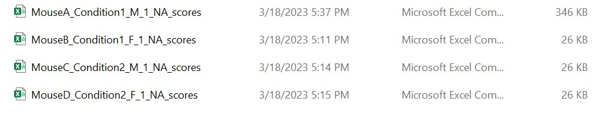

# SleepInvestigatoR
A function for the analysis of scored rodent sleep

## Overview

SleepInvestigatoR is a flexible R function used for processing scored rodent sleep. It takes multiple idividual scored sleep files and outputs a single .csv file containing 84 different measures. Sleep can be scored in any software of one's choosing as long as scores are output to a .csv file with no header and contains only three states: Wake, NREMS, and REMS. Lastly, there is a separate plotting function incoporated for quick generation of graphics to immediately check the output of the most commonly reported measures. A link to brief videos can be found at the bottom of this page running through how each function is used.

Note: I use ' ' quotes below to indicate what should be typed as is **without** quotes and " " double quotes to indicate what needs to be typed **with** quotes in the function. R, however, does not distinguish between different quotes and this dichotomy is just for clarity within this document. It should also be said that R is case sensitive and starts at 1 when counting unlike other languages.

## Download R and R Studio

There are many resources on the internet including videos to help you easily download R and R Studio. SleepInvestigatoR does not require anything fancy. 

One resource is provided below:

https://rstudio-education.github.io/hopr/starting.html

## File Types

The most fool proof option is to have all files saved as .csv with no header (see bottom of page). Sirenia (pinnacle) files are also accepted. By default 'file.type' is set to 'csv', if the user wants to use raw sirenia files they must change 'file.type = "Sirenia"'.

## File Naming

For easiest processing of files I reccomend the following naming convention for all scored sleep files: Animal ID/id factor_Grouping factor/Treatment/Condition_Animal Sex_Cohort_Age_whatever else. Underscores are safest option though it should recognize any punctuation marks between items of the name. For Sex, Cohort, and Age an 'NA' can be placed instead if that information is not present.

Example files would read: Mouse1_CondtionA_Male_Cohort1_6mo_scores, Mouse1_ConditionB_Female_Cohort1_6mo_scores, etc. 

SleepInvestigator allows you to set either or both id.factor or grouping.factor to 'FALSE' in which case SleepInvestigator will supply NAs for groups and internally delienate animals respectively.

## Before you run SleepInvestigatoR

SleepInvestgatoR uses base R, the data.table package, and tidyverse to perform its operations. These must be installed prior to use if they have **never** been installed before. This only has to be done once using the install.packages function. The user can quickly do this by deleting the hashtages before the install.packages functions at the top of the script under the 'Necessary Packages' header and hitting run.

**Everytime** before you use SleepInvestigatoR you must load the data.table and tidyverse packages by using the library function. Similar to before, the user can run these library lines at the top of the script.

Lastly, you must designate a filepath which must be the folder name (and associated path) that you put all the scored sleep files in (note no other files can be in this folder)

E.g. filepath for windows: "C:/Users/Mackenzie/Documents/Test Data" (note: the forward slashes)

After naming your filepath (being careful to maintain the quotes and forward slashes) you can highlight the three lines of code under the 'Set working directory...' header and click run

## Loading SleepInvestigatoR

Now put your cursor in front of the 'SleepInvestigatoR' function and hit run. This will load the function into R so you can use it (this will take a few seconds to complete). It will look like the below.

`SleepInvestigatoR()`

Once loaded you can now type into your console: 'SleepInvestigatoR('User determined parameters')' and hit enter to run the function. See below for parameter options and an example with basic parameters.

## Parameter options

There are 25 parameters which you can set, they are listed below:

**1. FileNames**

   By default 'FileNames' are named FileNames. Just type 'FileNames = FileNames' to be thorough.
   
**2. file.type**

   By default 'file.type = "csv"' to read .csv files. Change 'file.type = "Sirenia"' if that is what you are using.
   
**3. epoch.size**

   By default 'epoch.size = 4' (which is in seconds). Set to the number of seconds you scored in.
   
**4. max.hours**

   If 'max.hours' is set to some number then it will truncate **all** file lengths so they equal this number of hours so all files are consistent. Useful if you want to trim excess scored epochs that are irrelevant. By default this is set to 'NULL' and so wont run.
   
**5. byBlocks**

   By default, this is set to 'NULL' so it won't run. If you change 'byBlocks = # (some number)' it will divide each file into that many blocks. For example, if all your    files are six hours long then setting 'byBlocks = 6' will result in hourly data and if set to 3 instead you will have bihourly data. 
   
**6. byTotal**

   By default, this is set to 'TRUE' which means that it calculates all measures across the entire scored sleep period. For example, if all your files are 12 hours long all measures will be calculated over these 12 hours. Both byBlocks and byTotal are able to be run together producing two outputs one for each.
    
**7. score.checker**
   
   By default, this is set to 'TRUE'. Score.checker looks for any Wake to REM transitions across all files which under most circumstances is user error. It will stop the     function and notify the user what file and where this presumed error occured so it can be corrected. The function will then have to be run again. If you are studying     narcolepsy, for example, where this behavior is expected score.checker can be set to 'FALSE' and it will not flag these transitions as issues.
    
**8. score.value.changer**

SleepInvestigatoR requires sleep-wake to be scored in a 1,2,3 format where 1 = Wake, 2 = NREMS, and 3 = REMS. If you scored your sleep in another format then you can specify which values are Wake, NREMS, and REMS in that order and it will change them into 1,2,3 format. For example, if you score sleep as Wake is equal to 101, NREMS = 102, and REMS = 103 then you would write 'score.checker = c(101,102,103)'. By default this is set to 'NULL' and will not run.
   
**9. sleep.adjust**

sleep.adjust can be used to crop off the beginning of a scored sleep file. There are four options: 'NREMS Onset', 'REMS Onset', 'Sleep Onset', or a user defined fixed number of epochs. NREMS Onset and REMS Onset will set truncate each animal's file to start at first NREMS or REMS bout (minimum bout length determined in a different function). Sleep Onset will allow for a combination of NREMS and REMS at the set minimum bout length. By default this is set to 'NULL' and will not run.

**10. id.factor**

   By default this is set to 'TRUE' indicating that that the first word in the file name of each file name is the animal id. When set to 'FALSE' the function will create    an id to keep track of separate files essentially turning it into a file indicator and not an animal indicator

**11. group.factor**

   By default this is set to 'TRUE' indicating that the second word in the file name following punctuation (e.g., underscore) is the grouping factor such as treatment or    condition. When set to 'FALSE' the group.factor column will be filled with NAs

**12. normalization**

   By default this is set to 'FALSE' when given the condition name of a basleine line recording (e.g., BL) it calculates all measures normalized to this baseline

**13. time stamp**

   By default is set to 'FALSE' when set to 'TRUE' indicates that that time stamped bouts are present and that you want to calculate relevant metrics from these time stamps (e.g., ZTs).

**14. time separator**

   Indicates the format times are provided in the time stamps. By default it is set to hh:mm:ss

**15. date format**

   Indicates the format dates are provided in the time stamps. By default it is set to m/d/y.

**16. date separator**

   The variable used to separate date and time in the provided time stamps. By default is set to '' (represents space)
   
**17. lights on**

   The local clock time in the time stamps that the lgihts turn on.
   
**18. lights off**

   The loca clock time in the time stamps that the lights turn off. 
   
**19. NREM.cutoff**

   Sets the mininum number of uninterrupted epochs to be consider a formal bout of NREMS. This is dependent on epoch.size. So if epoch.size is set to 4 seconds then setting 'NREM.cutoff = 15' means that the minimum bout length counted as a NREMS bout is 60 secs. What you set as the cutoff will determine other statistics dependent on bout length. You can set this to 1 so the minimum bout length is equivalent to one epoch. By default this is set to 15.

**20. REM.cutoff**

   See NREM.cutoff for details

**21. Wake.cutoff**

   See NREM.cutoff for details

**22. Sleep.cutoff**

   Similar to other cutoff parameters except this considers NREMS and REMS collapsed so a mixture of the two states can be used to reach the set criterion.

**23. Propensity.cutoff**

   Used to set the cutoff value for minimum bout length in propensity measurements. Value chosen here will be used for **both** states in the propensity measurement. So if looking at the average duration between Wake and NREMS, setting 'Propensity.cutoff = 15' with an epoch.size of 4 sec will mean that for the bout to be counted both wake and NREMS will need to be 60 seconds in duration. See NREM.cutoff for more details.

**24. data.format**

   By default the format is set 'long' and can be set to 'wide' instead allowing for easy input into a variety of statistical programs

**25. save.name**

   Choose a name (put into quotes) for the output to saved as. This .csv file will be placed in the same folder as the sleep scored files. For example, 'save.name =        "Test"'. Be sure to remove the analyzed file from the scored sleep files if you want to run SleepInvestigator again as it will produce an error.

E.g.

`SleepInvestigatoR(FileNames = FileNames, max.hours = 12, byBlocks = 12)`

This will produce data hourly for 12 hours.

## Measures

**Animal ID**
* Identification factor tying the unique individual to their respective data

**Grouping Factor**
* Indicates the group (if any) the individuals may belong to tying the different groups to their respective data. E.g. Condition, Treatment

**Blocks**
* Indicates the blocks (or chunks) the data belong to which corresponds to a certain amount of time depending on the length of the data and number of blocks specified. E.g. 6 hrs of data set to 6 blocks corresponds to hourly data. 

**Total Hours**
* Total number of hours in the file

**Latency to NREMS**
* Amount of time before the first bout of NREMS 

Related: Latency to REMS, Latency to Sleep
Dependent on: NREMS cutoff value (minimum length of the time to count as a bout)

**Latency to REMS**
* Amount of time before the first bout of REMS 

Related: Latency to NREMS, Latency to Sleep
Dependent on: REMS cutoff value (minimum length of the time to count as a bout)

**Latency to Sleep**
* Amount of time before the first bout of sleep. That is any combination of NREMS and REMS 

Related: Latency to NREMS, Latency to REMS
Dependent on: Sleep cutoff value (minimum length of the time to count as a bout)

**Latency to Wake from NREMS**
* Amount of time it takes to start the first wake bout following the first bout of NREMS. 

Related: Latency to Wake from REMS, Latency to Wake from Sleep
Dependent on: Wake and NREMS cutoff values (minimum length of the time to count as a bout)

**Latency to Wake from REMS**
* Amount of time it takes to start the first wake bout following the first bout of REMS. 

Related: Latency to Wake from NREMS, Latency to Wake from Sleep
Dependent on: Wake and REMS cutoff values (minimum length of the time to count as a bout)

**Latency to Wake from Sleep**
* Amount of time it takes to start the first wake bout following the first bout of NREMS/REMS, including mixed NREMS-REMS (sleep). 

Related: Latency to Wake from NREMS, Latency to Wake from REMS
Dependent on: Wake and Sleep cutoff values (minimum length of the time to count as a bout)

**NREMS Onset**
* Epoch indicating the first bout of NREMS.

Related: REMS Onset, Sleep Onset
Dependent on: NREMS cutoff value (minimum length of the time to count as a bout)

**REMS Onset**
* Epoch indicating the first bout of REMS.

Related: NREMS Onset, Sleep Onset
Dependent on: NREMS cutoff value (minimum length of the time to count as a bout)

**Sleep Onset**
* Epoch indicating the first bout of sleep (NREMS or REMS, including mixed NREMS-REMS).

Related: NREMS Onset, REMS Onset
Dependent on: Sleep cutoff value (minimum length of the time to count as a bout)

**Post-NREMS Wake Onset**
* Epoch indicating the first bout of wake after the first bout of NREMS

Related: Post-REMS Wake Onset, Post-Sleep Wake Onset
Dependent on: NREMS and Wake cutoff values (minimum length of the time to count as a bout)

**Post-REMS Wake Onset**
* Epoch indicating the first bout of wake after the first bout of REMS

Related: Post-NREMS Wake Onset, Post-Sleep Wake Onset
Dependent on: REMS and Wake cutoff values (minimum length of the time to count as a bout)

**Post-Sleep Wake Onset**
* Epoch indicating the first bout of wake after the first bout of sleep

Related: Post-NREMS Wake Onset, Post-REMS Wake Onset
Dependent on: REMS and Wake cutoff values (minimum length of the time to count as a bout)

**Propensity to enter NREMS**
* Average duration from the beginning of a bout of wake to a bout of NREMS

Related: Propensity to enter REMS, Propensity to enter sleep
Dependent on: NREMS and Wake cutoff values (minimum length of the time to count as a bout)

**Propensity to enter REMS**
* Average duration from the beginning of a bout of wake to a bout of REMS

Related: Propensity to enter NREMS, Propensity to enter sleep
Dependent on: REMS and Wake cutoff values (minimum length of the time to count as a bout)

**Propensity to enter sleep (or inversely propensity to remain awake)**
* Average duration from the beginning of a bout of wake to a bout of sleep

Related: Propensity to enter NREMS, Propensity to enter REMS
Dependent on: Sleep and Wake cutoff values (minimum length of the time to count as a bout)

**Propensity to Wake from NREMS (or inversely the propensity to stay in NREMS)**
* Average duration from the beginning of a bout of NREMS to a bout of wake

Related: Propensity to Wake from REMS, Propensity to Wake from sleep
Dependent on: NREMS and Wake cutoff values (minimum length of the time to count as a bout)

**Propensity to Wake from REMS (or inversely the propensity to stay REMS)**
* Average duration from the beginning of a bout of REMS to a bout of wake

Related: Propensity to Wake from NREMS, Propensity to Wake from sleep
Dependent on: REMS and Wake cutoff values (minimum length of the time to count as a bout)

**Propensity to Wake from Sleep (or inversely the propensity to stay asleep)**
* Average duration from the beginning of a bout of sleep to a bout of wake

Related: Propensity to Wake from NREMS, Propensity to Wake from REMS
Dependent on: Sleep and Wake cutoff values (minimum length of the time to count as a bout)

**NREMS Onset Bout Length**
* Length of first bout of NREMS.

Related: REMS Onset Bout Length, Sleep Onset Bout Length
Dependent on: NREMS cutoff value (minimum length of the time to count as a bout)

**REMS Onset Bout Length**
* Length of first bout of REMS.

Related: NREMS Onset Bout Length, Sleep Onset Bout Length
Dependent on: REMS cutoff value (minimum length of the time to count as a bout)

**Sleep Onset Bout Length**
* Length of first bout of sleep (NREMS or REMS, including mixed NREMS-REMS).

Related: NREMS Onset Bout Length, REMS Onset Bout Length
Dependent on: Sleep cutoff value (minimum length of the time to count as a bout)

**Post-NREMS Wake Onset Bout Length**
* Length of first bout of wake following first NREMS bout.

Related: Post-REMS Wake Onset Bout Length, Post-Sleep Wake Onset Bout Length
Dependent on: NREMS and Wake cutoff values (minimum length of the time to count as a bout)

**Post-REMS Wake Onset Bout Length**
* Length of first bout of wake following first REMS bout.

Related: Post-NREMS Wake Onset Bout Length, Post-Sleep Wake Onset Bout Length
Dependent on: REMS and Wake cutoff values (minimum length of the time to count as a bout)

**Post-Sleep Wake Onset Bout Length**
* Length of first bout of wake following first sleep (NREMS or REMS, including mixed NREMS-REMS) bout.

Related: Post-NREMS Wake Onset Bout Length, Post-REMS Wake Onset Bout Length
Dependent on: Sleep and Wake cutoff values (minimum length of the time to count as a bout)

**NREMS Offset**
* Last epoch of the last bout of NREMS.

Related: REMS Offset, Sleep Offset
Dependent on: NREMS cutoff value (minimum length of the time to count as a bout)

**REMS Offset**
* Last epoch of the last bout of REMS.

Related: NREMS Offset, Sleep Offset
Dependent on: REMS cutoff value (minimum length of the time to count as a bout)

**Sleep Offset**
* Last epoch of the last bout of sleep (NREMS or REMS, including mixed NREMS-REMS).

Related: NREMS Offset, REMS Offset
Dependent on: Sleep cutoff value (minimum length of the time to count as a bout)

**NREMS Offset Bout Length**
* Length of last NREMS bout.

Related: REMS Offset Bout Length, Sleep Offset Bout Length
Dependent on: NREMS cutoff value (minimum length of the time to count as a bout)

**REMS Offset Bout Length**
* Length of last REMS bout. 

Related: NREMS Offset Bout Length, Sleep Offset Bout Length
Dependent on: REMS cutoff value (minimum length of the time to count as a bout)

**Sleep Offset Bout Length**
* Length of last bout of Sleep

Related: NREMS Offset Bout Length, REMS Offset Bout Length
Dependent on: Sleep cutoff value (minimum length of the time to count as a bout)

**Wake to NREMS Transition Count**
* A count of the number of transitions made from an instance of Wake of any length to an instance of NREMS of any length. This measure is not dependent on bout length.

Related: Wake-REMS Transition Count, NREMS to Wake Transition Count, NREMS to Wake Transition Count, NREMS to REMS Transition Count, REMS to Wake Transition Count, REMS to NREMS Transition Count

**Wake to REMS Transition Count**
* A count of the number of transitions made from an instance of Wake of any length to an instance of REMS of any length. This measure is not dependent on bout length.
Related: Wake to NREMS Transition Count, NREMS to Wake Transition Count, NREMS to REMS Transition Count, REMS to Wake Transition Count, REMS to NREMS Transition Count

**NREMS to Wake Transition Count**
* A count of the number of transitions made from an instance of NREMS of any length to an instance of Wake of any length. This measure is not dependent on bout length.

Related: Wake to NREMS Transition Count, Wake to REMS Transition Count, NREMS to REMS Transition Count, REMS to Wake Transition Count, REMS to NREMS Transition Count

**NREMS to REMS Transition Count**
* A count of the number of transitions made from an instance of NREMS of any length to an instance of REMS of any length. This measure is not dependent on bout length.

Related: Wake to NREMS Transition Count, Wake to REMS Transition Count, NREMS to Wake Transition Count, REMS to Wake Transition Count, REMS to NREMS Transition Count

**REMS to Wake Transition Count**
* A count of the number of transitions made from an instance of REMS of any length to an instance of Wake of any length. This measure is not dependent on bout length.

Related: Wake-NREMS Transition Count, Wake-REMS Transition Count, NREMS to Wake Transition Count, NREMS to REMS Transition Count, REMS to NREMS Transition Count

**REMS to NREMS Transition Count**
* A count of the number of transitions made from an instance of REMS of any length to an instance of NREMS of any length. This measure is not dependent on bout length.

Related: Wake-NREMS Transition Count, Wake-REMS Transition Count, NREMS to Wake Transition Count, NREMS to REMS Transition Count, REMS to Wake Transition Count

**Wake Epoch Count**
* A count of the total number of Wake epochs

Related: NREMS Epoch Count, REMS Epoch Count

**NREMS Epoch Count**
* A count of the total number of NREMS epochs

Related: Wake Epoch Count, REMS Epoch Count

**REMS Epoch Count**
* A count of the total number of REMS epochs

Related: Wake Epoch Count, NREMS Epoch Count

**Wake Seconds**
* Total number of seconds of Wake

Related: NREMS Seconds, REMS Seconds
Dependent on: Epoch Size

**NREMS Seconds**
* Total number of seconds of NREMS 

Related: Wake Seconds, REMS Seconds
Dependent on: Epoch Size

**REMS Seconds**
* Total number of seconds of REMS

Related: Wake Seconds, NREMS Seconds
Dependent on: Epoch Size

**Wake Percent**
* Percentage of time spent in Wake.

Related: NREMS Percent, REMS Percent

**NREMS Percent**
* Percentage of time spent in NREMS.

Related: Wake Percent, REMS Percent

**REMS Percent**
* Percentage of time spent in REMS.

Related: Wake Percent, NREMS Percent

**Arousal Count**
* Number of instances of wake of any length. Each consecutive instance of wake is a count (even if a length of solely 1).
   * Not the same as wake epoch count which counts every non-consecutive instance of wake no matter if it proceeds or follows another instance of wake.
   * Result is the same as if you set wake cutoff to 1 for wake bout count.

Related: Microarousal Count
Other names: Number of awakenings

**Microarousal Count**
* Number of wake bouts less than the wake cutoff value.
   * E.g., If a bout is user defined as 15 epochs (60 sec if scored at 4 sec) then it will only count bouts of wake less than 15 epochs.
   * If wake cutoff is set to 1 then it will count only bouts equal to cutoff value.

Related: Arousal Count
Other names: Number of brief awakenings
Dependent on: Wake cutoff value (minimum length of the time to count as a bout)

**Wake Bout Count**
* Number of Wake bout counts.

Related: NREMS Bout Count, REMS Bout Count, Sleep Bout Count
Other names: Wake Episode Count
Dependent on: Wake cutoff value (minimum length of the time to count as a bout)

**NREMS Bout Count**
* Number of NREMS bout counts.

Related: Wake Bout Count, REMS Bout Count, Sleep Bout Count
Other names: NREMS Episode Count
Dependent on: NREMS cutoff value (minimum length of the time to count as a bout)

**REMS Bout Count**
* Number of REMS bout counts.

Related: Wake Bout Count, NREMS Bout Count, Sleep Bout Count
Other names: REMS Episode Count
Dependent on: REMS cutoff value (minimum length of the time to count as a bout)

**Sleep Bout Count**
* Number of Sleep bout counts.

Related: Wake Bout Count, NREMS Bout Count, REMS Bout Count
Other names: Sleep Episode Count
Dependent on: Sleep cutoff value (minimum length of the time to count as a bout)

**Avg Wake Bout Duration**
* Average length of time of a Wake bout.

Related: Avg NREMS Bout Duration, Avg REMS Bout Duration, Avg Sleep Bout Duration
Dependent on: Wake cutoff value (minimum length of the time to count as a bout)

**Avg NREMS Bout Duration**
* Average length of time of a NREMS bout.

Related: Avg Wake Bout Duration, Avg REMS Bout Duration, Avg Sleep Bout Duration
Dependent on: NREMS cutoff value (minimum length of the time to count as a bout)

**Avg REMS Bout Duration**
* Average length of time of a REMS bout. 

Related: Avg Wake Bout Duration, Avg NREMS Bout Duration, Avg Sleep Bout Duration
Dependent on: REMS cutoff value (minimum length of the time to count as a bout)

**Avg Sleep Bout Duration**
* Average length of time of a Sleep bout. 

Related: Avg Wake Bout Duration, Avg NREMS Bout Duration, Avg REMS Bout Duration 
Dependent on: Sleep cutoff value (minimum length of the time to count as a bout)

**Avg Wake Interbout Interval**
* Average length of time between Wake bouts.

Related: Avg NREMS Interbout Interval, Avg REMS Bout Duration 
Dependent on: Wake cutoff value (minimum length of the time to count as a bout)
Other names: inter-Wake interval

**Avg NREMS Interbout Interval**
* Average length of time between NREMS bouts.

Related: Avg Wake Interbout Interval, Avg REMS Bout Duration 
Dependent on: NREMS cutoff value (minimum length of the time to count as a bout)
Other names: inter-NREMS interval

**Avg REMS Interbout Interval**
* Average length of time between REMS bouts.

Related: Avg Wake Interbout Interval, Avg NREMS Bout Duration 
Dependent on: REMS cutoff value (minimum length of the time to count as a bout)
Other names: inter-REMS interval

**WASO**
* Total Recording Time -  Total Sleep Time (aka Total Time Awake) - NREMS Latency
* Total amount of wake after sleep onset (first sleep bout) 

Related: WASF
Dependent on: Epoch size

**WASF**
* Total Recording Time -  Sleep Offset
* Total amt of wake after sleep offset (last bout of sleep, NREMS or REMS)

Related: WASO
Dependent on: Epoch size

**Sleep Fragmentation Index**
* Arousal Count / Total Time in Sleep 

Related: Arousal Count
Other names: Arousal Index
Dependent on: Epoch size

**Total Sleep Time**
* Total amount of time spent in NREMS + REMS

Dependent on: Epoch size

**Sleep Efficiency**
* Total Sleep Time/Total Recording Time

Dependent on: Epoch size

**W/N/RBC (Wake or NREMS or REMS Bout Count)**
* Wake or NREMS or REMS bout count of set length determined by epoch size as reported by Trachel et al., 1991

Related: Wake Bout Count, NREMS Bout Count, REMS Bout Count
Dependent on: Wake/NREMS/REMS cutoff value (minimum length of the time to count as a bout)

   **W/N/RBC group 1**
   * Bouts == epoch size
   * E.g., for epoch size of 4, count all bouts of 4 sec in length (or 1 epoch)
   **W/N/RBC group 2**
   * Bouts >= epoch size*2 & < epoch size*4
   * E.g., For epoch size of 4, count all bouts greater than or equal to 8 sec and less than 16 sec (or bw 2-3 epochs)
   **W/N/RBC group 3**
   * Bouts >= epoch size*4 & < epoch size*8,
   * E.g., For epoch size of 4, count all bouts greater than or equal to 16 sec and less than 32 sec (or bw 4-7 epochs)
   **W/N/RBC group 4**
   * Bouts >= epoch size*8 & < epoch size*16
   * E.g., For epoch size of 4, count all bouts greater than or equal to 32 sec and less than 64 sec (or bw 8-12 epochs)
   **W/N/RBC group 5**
   * Bouts >= epoch size*16 & < epoch size*32
   * E.g., For epoch size of 4, count all bouts greater than or equal to 64 sec and less than 128 sec (or bw 16-28 epochs)
   **W/N/RBC group 6**
   * Bouts >= epoch size*32 & < epoch size*64
   * E.g., For epoch size of 4, count all bouts greater than or equal to 128 sec and less than 256 sec (or bw 32-60 epochs)
   **W/N/RBC group 7**
   * Bouts >= epoch size*64 & < epoch size*128
   * E.g., For epoch size of 4, count all bouts greater than or equal to 256 sec and less than 512 sec (or bw 64-124 epochs)
   **W/N/RBC group 8**
   * Bouts >= epoch size*128 & < epoch size*256
   •	E.g., For epoch size of 4, count all bouts greater than or equal to 512 sec and less than 1024 sec (or bw 128-252 epochs)
   **W/N/RBC group 9**
   * Bouts >= epoch size*256
   * E.g., For epoch size of 4, count all bouts greater than 1024 sec (or 256 epochs)

## Plotting

   A small plotting function is included as a separate script for quick and efficient visualization of scored sleep analyzed by SleepInvestigatoR. It plots the most common sleep sleep measures for a byTotal or byBlock data frame. This includes: percent of each sleep-wake state, latency to NREMS + REMS, state change transition counts, sleep-wake bout counts, and sleep-wake bout durations. This function allows the user to quickly get a feel for the data. Users should be able to determine if there are possible issues and otheriwse look at trends. The graphs for simplicity and ease of fitting on one 'page' mostly omit error margins. This may be changed in future iterations.
   
   ### Function
   
   `plot.overview('user defined parameters')`
   
   ### Parameters
   
   **1. data**

   Name of data file output from SleepInvestigatoR
      
   **2. type**

   Whether it the data is byTotal or byBlocks

   **3. image.name**

   Chosen name of image file. Only need to specify if saving the image locally.

   **4. image.ext**

   Image format. E.g., jpg. Only need to specify if saving the image locally.
   
   **5. width**

   Width of the image desired. Only need to specify if saving the image locally.
   
   **6. height**

   Height of the image desired. Only need to specify if saving the image locally.

## Example Images

   File Organization
   
   
   
   File Naming and Folder Organization
   
   
   
   Plotting
   
   

 
